# Basic WebPack Works
## IS 219 - Richard Jeong
## Basic Web Pack with auth0
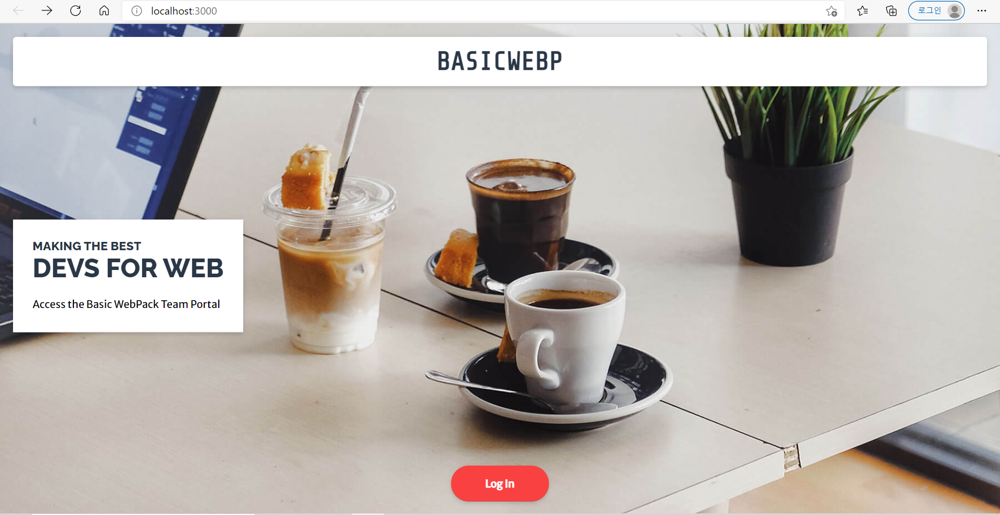
## api cities page
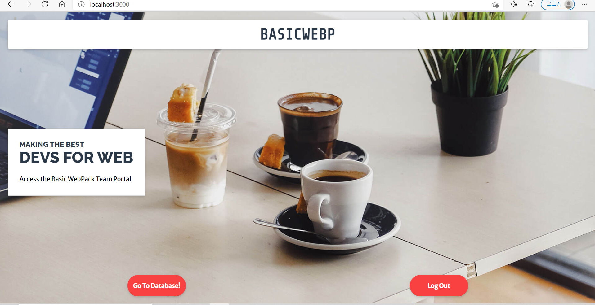
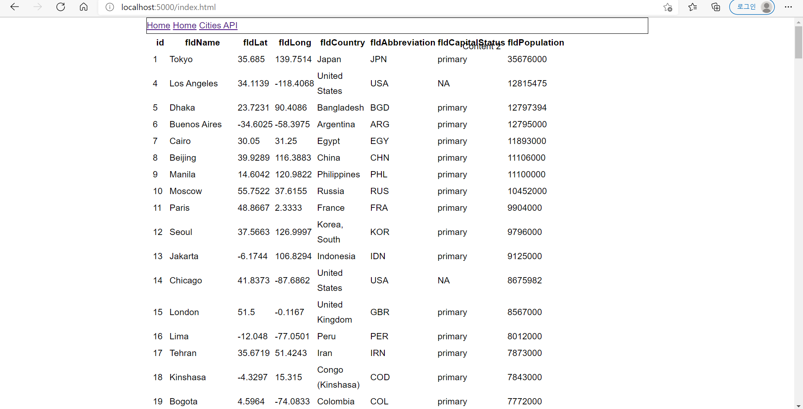
# Express Authentication
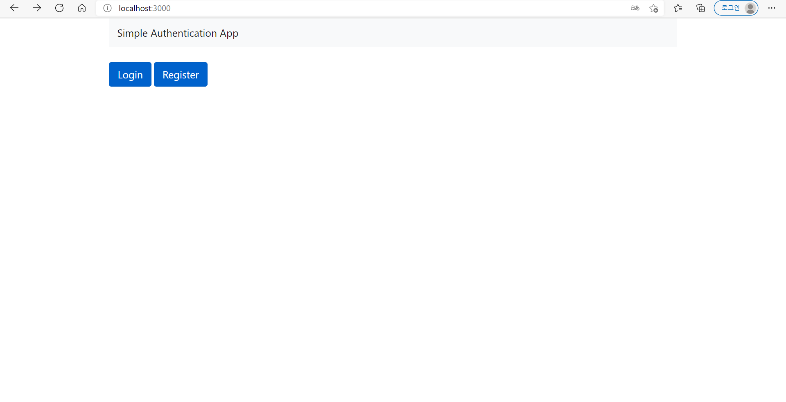

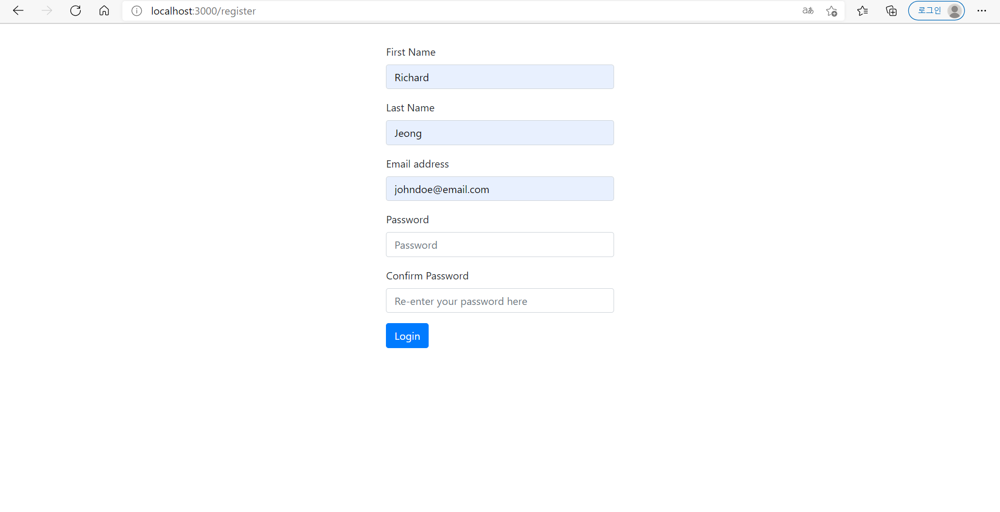
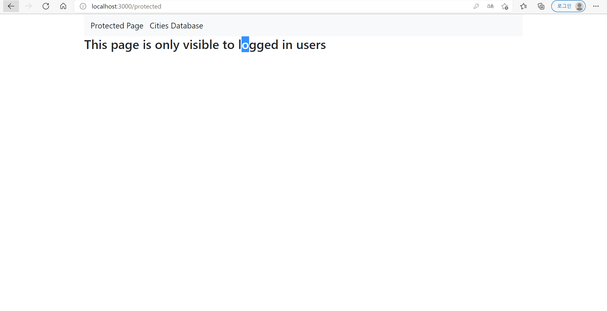
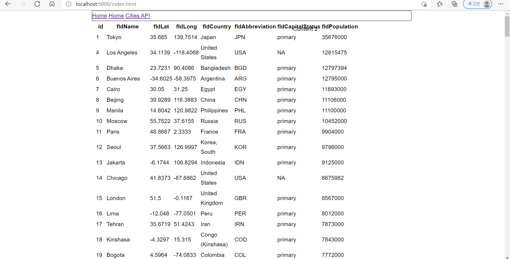
## Link
http://localhost:8000

http://localhost:8000/api/v1/cities

## Postman Screenshots for Crud:

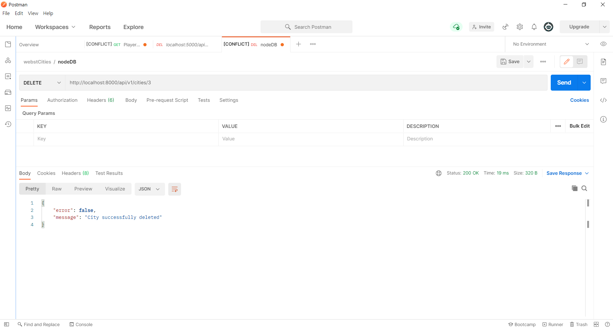
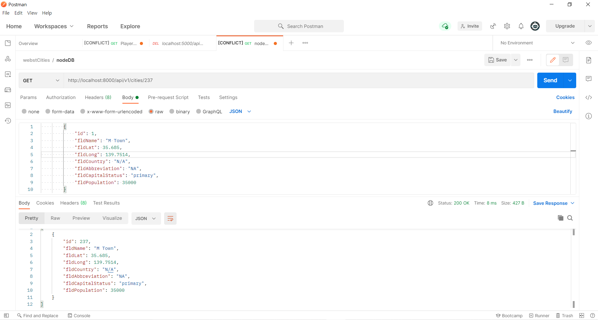
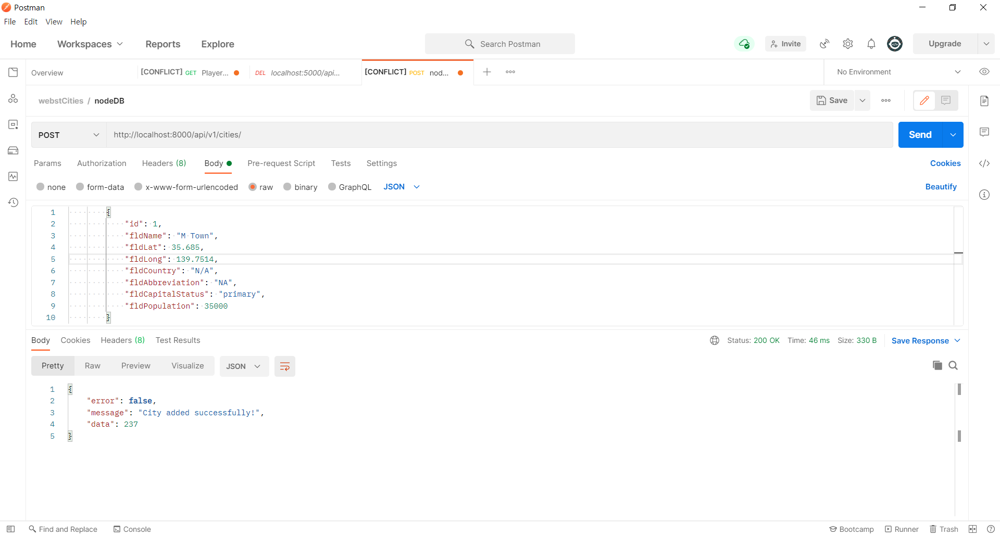
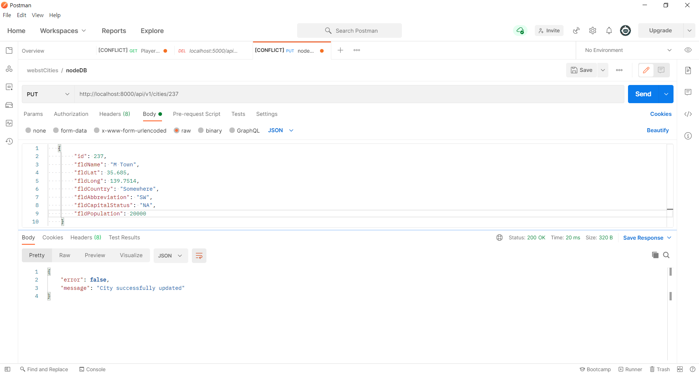