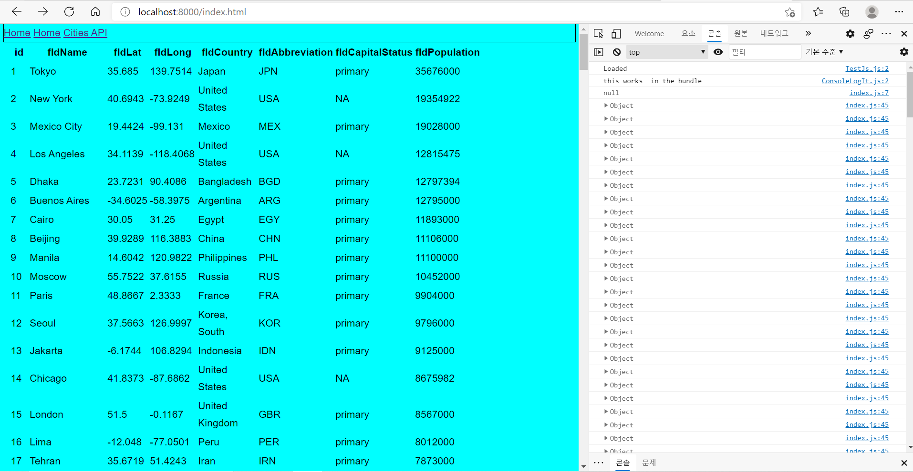

# Basic WebPack Works
## IS 219 - Richard Jeong
## Web Browser for table and console

## api cities page

## Link
http://localhost:8000

http://localhost:8000/api/v1/cities

## Postman Screenshots for Crud:

